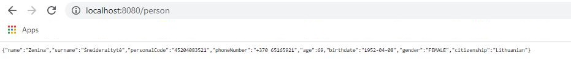

# Random Lithuanian Person data generator
 
App returns following Lithuanian person data in json format: Name, Surname, LT Personal code, Phone number, Age, Birthdate, Gender, Citizenship.



View on heroku:<br>
https://random-person-lithuanian.herokuapp.com/person<br>
https://random-person-lithuanian.herokuapp.com/swagger-ui/

#### Technologies used: 
- Spring Boot 2.7.1, 
- Java 11
- Swagger-UI, Maven

## Getting Started

- Clone the repository `git clone https://github.com/JurgitaVisa/person-generator.git`

### Run with Maven 

- go to project folder `cd {yourPathToFolder}/person-generator`
- Run `mvn spring-boot:run` (application will start on port 8080)  

http://localhost:8080/person

### Running the application with Executable JAR 

The code can also be built into a jar and then executed/run. 
Once the jar is built `person-generator.jar` file will appear in the `{yourPathToFolder}\person-generator\target` folder.
Run the jar by double clicking on it or by using the command provided.

```shell
$ cd {yourPathToFolder}/person-generator
$ mvn package -DskipTests
$ java -jar target/person-generator.jar --spring.profiles.active=test
```
To stop the jar run the following get processId and stop it:
```shell
$ netstat -ano | find "8080" 
$ taskkill /F /PID <yourprocessID>
```

### Running the application with Docker

To build and start Docker image:

```shell
$ cd {yourPathToFolder}/person-generator
$ docker build -t <anynameforimagehere> .
$ docker run -dp 8080:8080 --name <anycontainername> <nameyougaveyourimagehere>

```
The application will start on 8080 port http://localhost:8080/person

To stop the container run ```$ docker stop <nameyougaveyourcontainerhere>```

To start the container again ```$ docker start <nameyougaveyourcontainerhere>```

To remove the container stop it and run ```$ docker rm <nameyougaveyourcontainerhere>```

### Accessing API documentation

http://localhost:8080/swagger-ui/

### Data source and resources used

Names and surnames are read and stored in lists upon app startup from *.txt files located in the project's resources folder.

Resource used for names: http://www.varduzinynas.lt/vardai 

Resource used for surnames: http://pavardes.lki.lt/?pg=pavardziu_daznumas

## Author

Copyright&copy; 2021, JurgitaVisa
